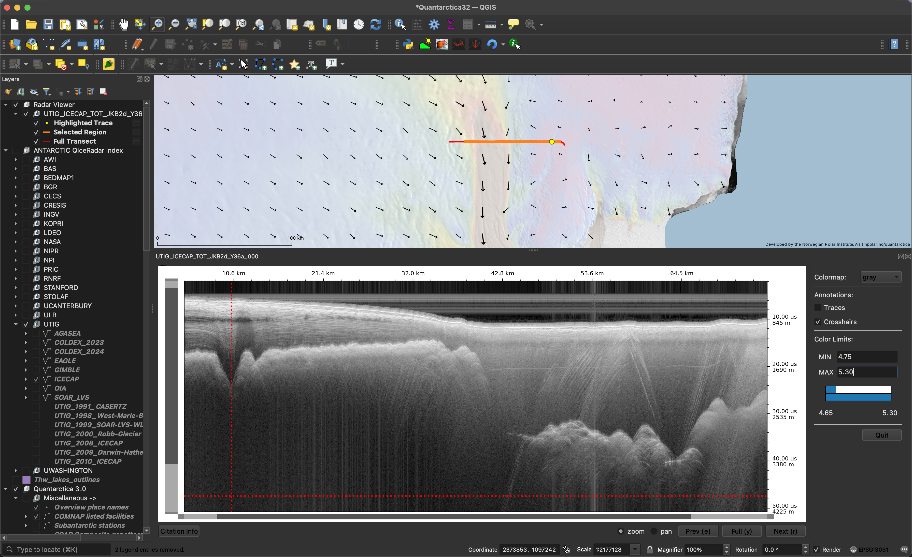

# QIceRadar

QIceRadar makes polar radar depth sounding data available in QGIS.

*Screencap of QGIS, using QIceRadar to view UTIG's TOT/JKB2d/Y36a radargram[1]. The map shows the full extent of this radargram (red line), the portion currently displayed in the viewer (orange line) and the location of currently-selected trace (yellow circle). The basemap includes data from Quantarctica[2]: surface velocity vectors and magnitude from MEaSUREs[3] and MODIS mosaic satellite imagery[4].*

There are two components to the project:
1. A GeoPackage index containing the groundtracks of known radargrams, along with metadata about which institution collected the data, whether and where it can be accessed, and relevant citations. (DOI: [10.5281/zenodo.12123014](zenodo.org/records/12123014))
2. A QGIS plugin that allows the user to select lines from the index in order to download and view them. (this repository)

QIceRadar is funded by NSF's CSSI program (#2209726).

## Getting Started

1. [Installation Instructions](.docs/installation.md)
2. [Tutorial](.docs/tutorial.md)

([Developers Guide](.docs/developers.md))

#### References

[1] Blankenship, D. D. et al.(2017). IceBridge HiCARS 2 L1B Time-Tagged Echo Strength Profiles, Version 1. Boulder, CO USA. NSIDC. https://doi.org/10.5067/0I7PFBVQOGO5.

[2] Matsuoka, K., Skoglund, A., & Roth, G. (2018). Quantarctica Norwegian Polar Institute. https://doi.org/10.21334/npolar.2018.8516e961

[3] Rignot, E., J. Mouginot, and B. Scheuchl. 2017. MEaSUREs InSAR-Based Antarctica Ice Velocity Map, Version 2. Boulder, Colorado USA. NASA National Snow and Ice Data Center Distributed Active Archive Center. doi: https://doi.org/10.5067/D7GK8F5J8M8R.

[4] Haran, T., J. Bohlander, T. Scambos, T. Painter, and M. Fahnestock. 2005, updated 2013. MODIS Mosaic of Antarctica 2003-2004 (MOA2004) Image Map, Version 1. [Indicate subset used]. Boulder, Colorado USA. NSIDC: National Snow and Ice Data Center. doi: http://dx.doi.org/10.7265/N5ZK5DM5.

