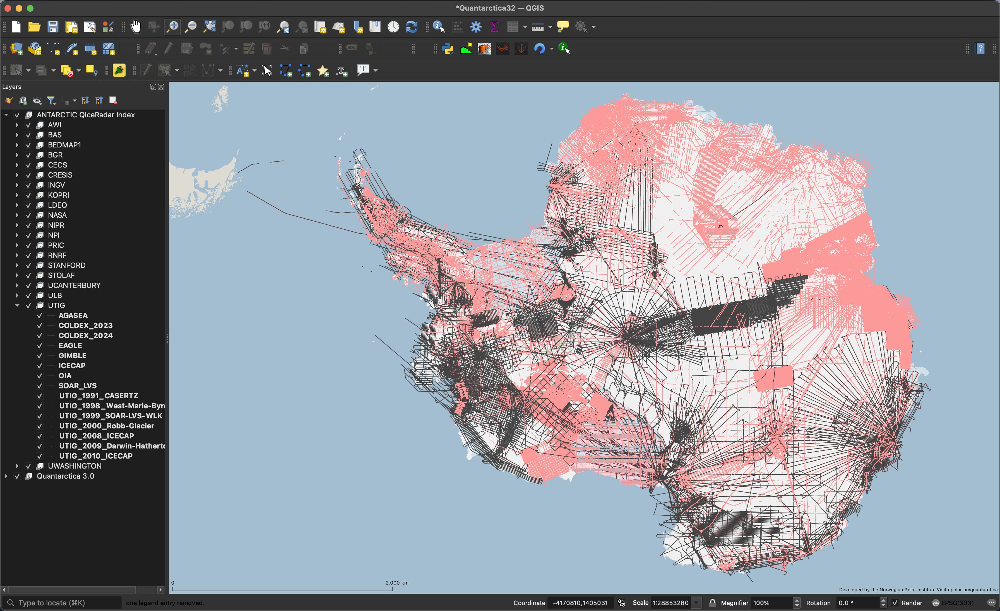
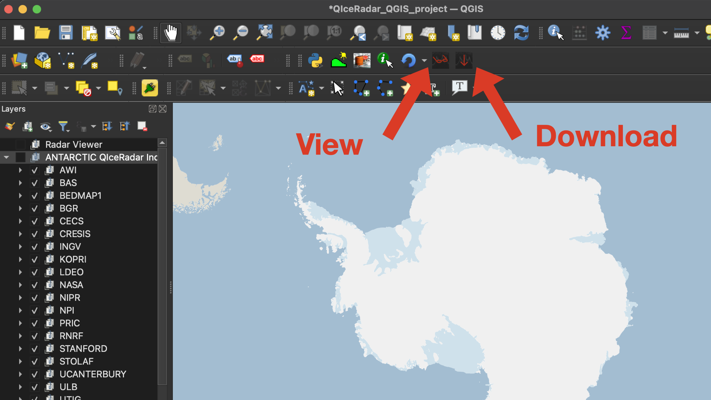

QIceRadar has been developed for QGIS 3.34 LTR, and tested on MacOS, Ubuntu 24.04, and Windows 11.

While other QGIS versions and operating systems may work, we do not have the resources to test additional combinations, though if you get it working let us know and we will update the information about user-reported successful configurations.

## Download Index

The index of Antarctic radar depth sounding data is on Zenodo: https://zenodo.org/records/12123013

Download `qiceradar_antarctic_index.gpkg` and `qiceradar_antarctic_index.qlr`:

* Save them into the same directory
* Do not rename the files

Open QGIS, open the project that you want to add the index to, then drag `qiceradar_antarctic_index.qlr` into the map pane.

*Screeshot of QGIS, after importing the index layer. Groundtracks of publicly-available radargrams are in dark grey, and groundtracks for unavailable radargrams are in red.*

This index has been compiled from the BedMAP3 data[1] (red lines) and coordinates extracted from the published radargrams (grey lines). Radar lines are grouped into surveys/campaigns and then into institutions, following the Bedmap3 classifications.

The QIceRadar plugins depend on the structure of this data:
* Import all features; selecting individual features to import will not work with the plugins. (If necessary, you can delete layers/institution groups after importing.)
* Do not rename the top-level group. If you do so, the plugin won't be able to find the data. It should be "ANTARCTIC QIceRadar Index"

## Install Plugin

Go to https://github.com/qiceradar/qiceradar
* Click "Code" -> "Download Zip"

In QGIS:
* Plugins -> "Manage and Install Plugins..."
* Click "Install from zip"
* Select the file downloaded earlier, and click "Install Plugin"

If the install worked, you should now see two icons:

In this case, continue on to the [tutorial](tutorial.md) for how to use the plugin.

**Troubleshooting**:

* Some web browsers may be set to auto-extract the zip file. In this case, disable that setting and try downloading it again
  * Safari: go to Safari -> "Settings..."; select the "General" tab, and at the bottom, uncheck "Open safe files after downloading"
* If you got an error about "ModuleNotFoundError: No module named ___", see [section below](#python-dependencies) about installing required python dependencies, then try again.

## Update Plugin

Download a new zip file from https://github.com/qiceradar/qiceradar

Then, in QGIS:
* Plugins -> "Manage and Install Plugins..."
* Under Installed, select QIceRadar, and click "Uninstall Plugin"
* Under "Install from zip", select the new file and click "Install Plugin"

## Update Index

Most often, changes to the index layer are associated with new code in the plugin to make use of them, in which case you should repeat the original installation process. However, there will be some releases that simply fix errors in the database, in which case it is only necessary to update the index.

To update to a new index file:
* Download the most recent index from https://zenodo.org/records/12123013
* Delete the old ANTARCTIC QIceRadar Index group
* drag in the new .qlr
* Force QIceRadar to re-initialize with the new index by disabling/reenabling.
  * Open Plugins -> "Manage and Install Plugins ..."
  * Select "Installed" in the left column
  * Uncheck then recheck the box next to QIceRadar

### Python dependencies
The QIceRadar radar_viewer plugin has dependencies on several python packages that may or may not have been packaged with your install of QGIS. These packages are: `numpy`, `matplotlib`, `h5py`, `netCDF4`, `boto3`.

If you got an error like `ModuleNotFoundError: No module named 'netCDF4'`, you'll need to install that module.

QGIS uses its own install of Python on MacOS and Windows, so we have to be careful to install into that version, rather than into the default system install.

After installing dependencies, restart QGIS.

#### Windows

If you used the default installer for QGIS 3.34 LTR, only netCDF4 will be missing:
* Open OSGeo4W Shell
* type `python3 -m pip install netCDF4`
* restart QGIS

More details are available in this guide: https://landscapearchaeology.org/2018/installing-python-packages-in-qgis-3-for-windows/

If you used the networked installer, follow this guide: https://fvwiki.tuflow.com/QGIS_3.14_Setup-NetCDF4

**Note about QGIS versions**: On Windows in particular, there is a conflict with h5py in some versions of QGIS. In this case, after pip installing h5py, any attempt to `import h5py` will immediately crash QGIS without any error messages. \
**Reported successes**: 3.34, 3.38 \
**Reported failures**: 3.28, 3.36

#### Ubuntu

If you installed QGIS using apt, it uses the system install of python. So, to install netCDF4, open a terminal and run:
`sudo apt install python3-netcdf4`

(Or use your favored package manager.)

#### Mac OS

On MacOS, the QGIS-LTR 3.34 installer seems to include all of our dependencies, so most users won't need to install it manually.

If you installed QGIS some other, way, first figure out where QGIS's python is installed:

Plugins -> Python Console
~~~
import sys
print(sys.executable)
~~~
On my machine, this prints \
"/Applications/QGIS-LTR.app/Contents/MacOS/QGIS"

So, I would use that version of pip. In a terminal, type: \
`/Applications/QGIS-LTR.app/Contents/MacOS/bin/pip3 install [module name]`

**Reported working QGIS verions**: 3.22 (not recommended!), 3.34

#### References
[1] Frémand, Alice C., et al. "Antarctic Bedmap data: FAIR sharing of 60 years of ice bed, surface and thickness data." Earth System Science Data Discussions 2022 (2022): 1-25.

