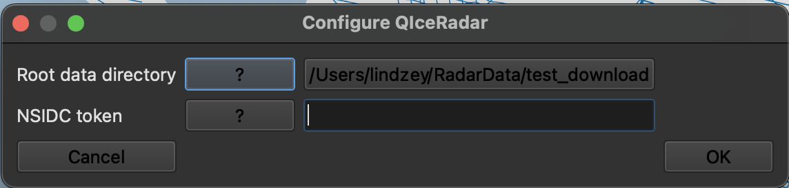

# QIceRadar Tutorial

## Initial Configuration

When you first click either of the QIceRadar plugin tooltips, you'll get an error mesage:

Click "Update Config":

then fill in the root directory where you want QIceRadar to save radargrams.

The other fields can stay empty for now; the first time you try to download data from NSIDC you will be prompted to update your config with that token. Click the "?" button for instructions on obtaining a token.

## Download Radargrams

Click the icon with the down arrow to activate the downloader tooltip:

To download a line, click on the line in the map.
A dialog box will pop up, giving five options ordered by distance from the clicked point. QIceRadar will only display segments that are currently visible in the layers menu.

Select the segment of interest and click OK.
Info about the selected radargram will appear:

After checking how much data you'll be downloading, click "Download" to start the download.

You can monitor download progress in the download panel, or cancel a download that’s taking too long.

After a segment has been successfully downloaded, it will turn purple in the map:

## View Radargrams

Click the icon with the eyeglasses to activate the viewer tooltip:

Click on the transect that you want to view. There will be the same selection menu as for the downloader, then a viewer dockwidget will pop up.

* Left-click and drag to zoom; the viewer supports zooming in to the full resolution in the published radargrams
* Right-click and drag to zoom out
* Or, click the "full" button to view the entire radargram.
* Click-and-drag in the left scroll bar to select a portion of the Y axis to view; same for the bottom scroll bar for the X axis.
* Use the Prev and Next buttons to scroll through a zoomed-in radargrams; each step will slightly overlap with the previously-displayed image.

Use the colormap dropdown and the color limits text entry boxes and/or sliders to adjust the appearance:

Activate the "Traces" checkbox to see a plot of intensities from a single trace of the radargram:

Activate the "Crosshairs" checkbox to associate features between the radargram and the map. A cursor will follow your mouse in the radargram, while the lat/lon of that trace will appear as a yellow point in the map view. Additionally, the map will always show the full extent of the radargram as a red line, and the currently-viewed extent as a thicker orange line.

Citation information is available by clicking the "Citation" button in the viewer.

## Modify Annotation Appearance

It is possible to change the appearance of the map layers created by QIceRadar.
Find the "QIceRadar Controls" dock widget, and right click on the type of annotation whose styling you want to change. 
This will change it for every map layer of that type. 
(So use this with caution if you are manually changing the styling of individual layers created by QIceRadar)

## QGIS tips:

* To toggle all features in a group between selected/unselected, hold “command” while clicking on the group’s checkbox. Use this to show/hide different institutions / campaigns.
* To find a specific segment within a campaign given its name: right-click on the campaign -> “Open attribute table” -> select the row of interest. This will highlight that segment on the map.

